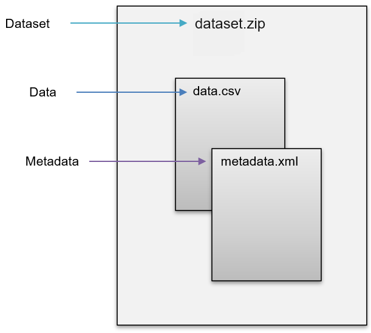

------------------------------------------------------------------------

 

## Specification of the Open Data Format

The Open Data Format (ODF) is dedicated to providing a non-proprietary data
format for data exchange and dissemination. In other words, it is the
data format that data producers can provide while data users can
import the data format into several statistical software.

The ODF consists of data and metadata organized in two
separate files (see Figure 2). The data is stored in CSV format and the
metadata is in XML. For data exchange, both files are packed into a ZIP
file. The ZIP file corresponds to the dataset to be used for various
statistics programs through import filters. Vice Versa, statistical
software is to be capable of exporting the native format to the
ODF.

The DDI-Codebook 2.5 metadata schema is the basis for the specification
of the metadata component in the ODF. Besides the
DDI-Codebook 2.5 schema, the ODF is to be extendable with
further existing metadata schemas.

Specification of a data file in the Open Data Format

 

## Profile

For the specification of a data format’s metadata component, a profile
is a useful tool. Typically, there are numerous possibilities and
variations on how metadata can be stored, even if it is the same file
format and the same metadata schema. This is a problem for the
development of technical solutions that are intended to use this
metadata. Especially when it comes to integrating different software,
different file formats, and different metadata schemas. Since a metadata
profile gives an overview of the semantic definition of the used
elements, attributes, and their constraints, a profile is an essential
tool for documenting the basis of application programming and
establishing interoperability between different technical environments.

For the Open Data Format, the specification of the metadata
component is oriented towards a standardized and well-established
structure since it is based on the DDI-Codebook 2.5 schema. According to
the DDI Alliance, DDI is “a very flexible and complex standard that may
be used by various projects or organizations in ‘customized’ ways that
best answer specific needs” (Source:
<https://ddialliance.org/learn/resources/ddi-profiles>). The profile of
the DDI-Codebook 2.5 schema, developed in this project, describes which
DDI elements are ‘Used’ or ‘Not Used’. Table 1 provides a preview of the
DDI-Codebook 2.5 profile specified for the Open Data Format.

|     | element.label  | element.description                                                                                                                                                                                                                                                                                                                       | xml file                             | xml\_classification                    |
|:----|:---------------|:------------------------------------------------------------------------------------------------------------------------------------------------------------------------------------------------------------------------------------------------------------------------------------------------------------------------------------------|:------------------------------------------|:---------------------------------------|
| 20  | variable name  | The attribute “name” usually contains the so-called “short label” for the variable, limited to eight characters in many statistical analysis systems such as SAS or SPSS.                                                                                                                                                                 | //codeBook/dataDscr/var\[@name\]          | mandatory if ‚var‘ element is present  |
| 21  | variable label | A short description of the variable. In the variable label, the length of this phrase may depend on the statistical analysis system used (e.g., some versions of SAS permit 40-character labels, while some versions of SPSS permit 120 characters), although the DDI itself imposes no restrictions on the number of characters allowed. | //codeBook/dataDscr/var/labl              | optional                               |
| 22  | language tag   | Attribute to specify the language of the <variable label>. &lt;Use ISO-639-1-Code for language subtags, e.g. en for English.&gt;                                                                                                                                                                                                          | //codeBook/dataDscr/var/labl\[@xml:lang\] | mandatory if ‚labl‘ element is present |

Table 1: Preview of the Open Data Format metadata profile based
on the DDI-Codebook 2.5 schema

Besides the documentary function, a profile is a handy tool for
validating a metadata file. The Consortium of European Social Science
Data Archives (CESSDA) provides an online application for validating
metadata XML files ([CESSDA Metadata
Validator](https://cmv.cessda.eu/#!validation)). The validator checks if
the structure, semantics, or the mandatory or optional usage of tags
within the metadata XML file corresponds to the declarations of the
profile. Since we provide a [profile XML
file](Profile/profile.xml), you can use the CESSDA
Metadata Validator to verify if your metadata is already interoperable
with the metadata profile specified for the ODF. To test
the validator tool from CESSDA you can download the metadata file from
this repository [metadata.xml](https://raw.githubusercontent.com/opendataformat/opendataformat.github.io/refs/heads/main/docs/files/metadata.xml)) and
validate against the ODF profil
(<a href="/docs/files/profile.xml" download>Download Profile</a>). 
For further information on the metadata profile, see [Profile](profile.html).

  
